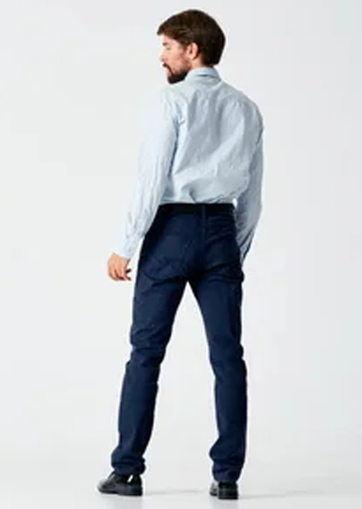

# Image Processing Pipeline with YOLOv8

This repository provides a Python-based image processing pipeline leveraging **YOLOv8** for person detection and **OpenCV** for image manipulation. The pipeline processes images by detecting persons, scaling them to a target bounding box height, cropping them to a specific aspect ratio (3:4), and saving intermediate and final outputs in organized folders. Additionally, it highlights key considerations, limitations, and future directions for further development.

---

## Why This Repository?

This pipeline is designed for tasks requiring precise detection and manipulation of images containing people. Its modular design enables easy customization and integration into broader workflows. Key features include:

- Reliable person detection with **YOLOv8**.
- Consistent output with fixed aspect ratio and bounding box scaling.
- Flexibility for handling various image processing requirements.

---

## Prerequisites

### Required Libraries

1. **`os`**: File and folder operations.
2. **`cv2` (OpenCV)**: Image reading, manipulation, and saving.
3. **`YOLO` from `ultralytics`**: State-of-the-art, real-time object detection.
4. **`matplotlib.pyplot`**: Debugging and visualization of image processing steps.

---

## Installation

Clone the repository and install the required libraries:

```bash
git clone https://github.com/yourusername/image-processing-pipeline.git
cd image-processing-pipeline

# Install required libraries
pip install opencv-python opencv-python-headless ultralytics matplotlib
```

---

## Configuration

Key parameters are defined as **global variables** in the script for easy customization:

- **`desired_box_height`**: Target height (in pixels) for the bounding box around the detected person. Default: `2600`.
- **`crop_width`**: Width of the cropped image. Default: `1920`.
- **`crop_height`**: Height of the cropped image. Default: `2700`.

The aspect ratio of the crop is fixed at **3:4**, which is ideal for portrait images.

---

## Folder Structure

- **`input_images`**: Folder for input images.
- **`output_images`**: Folder for final processed images.
  - **`working_images`**: Subfolder for intermediate results like bounding box annotations.

Example:
```
.
├── input_images
│   ├── image1.jpg
│   ├── image2.jpg
├── output_images
│   ├── image1.jpg
│   ├── image2.jpg
│   ├── working_images
│       ├── image1_step1_bounding_box.jpg
│       ├── image2_step2_upscaled_bounding_box.jpg
```

---

## How It Works

### Step-by-Step Process

1. **Person Detection (YOLOv8)**:
   - Detects persons in an image using YOLOv8.
   - Returns the coordinates (`x_min`, `y_min`, `box_width`, `box_height`) of the bounding box.

2. **Save Bounding Box (Step 1)**:
   - Annotates and saves the detected bounding box for debugging and verification.

3. **Scaling the Image**:
   - Scales the bounding box to match the `desired_box_height`.
   - Ensures the person is resized proportionally without distortion.

4. **Save Upscaled Bounding Box (Step 2)**:
   - Saves the upscaled image with the updated bounding box.

5. **Center Cropping (Step 3)**:
   - Crops the image to maintain the specified aspect ratio (3:4).

6. **Final Output**:
   - Saves the final cropped image.
   - Intermediate results are stored in the `working_images` folder for review.

---

## Upscaling Considerations

Initially, **Real-ESRGAN** was tested for intelligent upscaling but was not adopted due to:

- **Hardware Dependency**: Requires GPU, which is not always available.
- **Performance**: Longer processing times compared to bicubic upscaling.
- **Image Quality**: While Real-ESRGAN performs well on faces, it introduces artifacts or loses detail on textured materials like linen and silk.

For these reasons, **bicubic upscaling** was chosen as it provides satisfactory results, especially for upscaling factors up to **1.5x**, without significant image degradation.

### Call for Contributions

We welcome volunteers to:

- Test or develop more accurate models for intelligent upscaling.
- Propose solutions with better performance and acceptable processing times.

---

## Future Enhancements

### Generative AI for Background Expansion

A future goal is to leverage **generative AI** (e.g., Hugging Face models) to:

- Expand image backgrounds for cases where the detected person is too close to the image edge.
- Generate missing background areas to center the person without distorting the image composition.

This enhancement aims to maintain natural-looking results while resolving challenges caused by tight cropping.

---

## Code Overview

### Key Functions

1. **`process_images_in_folder(input_folder, output_folder)`**:
   - Processes all images in the input folder.

2. **`process_image(input_path, output_folder, working_folder)`**:
   - Executes the complete pipeline for a single image.

3. **`detect_person_with_yolo(image)`**:
   - Performs person detection and returns bounding box coordinates.

4. **`calculate_scaling_factor(box_height)`**:
   - Computes the scaling factor based on `desired_box_height`.

5. **`crop_image_to_center(image, box)`**:
   - Crops the image around the detected bounding box.

6. **`save_image_with_bounding_box(image, box, output_path, comment)`**:
   - Annotates and saves an image with the bounding box.

---

## How to Run

1. Add input images to the `input_images` folder.
2. Run the script:

```bash
python process_images.py
```

3. Processed images will be saved in the `output_images` folder.

---

## Run on Google Colab

This project is compatible with Google Colab for easy execution without local setup:

1. Open the file **`opencv_yolo.ipynb`** on Colab.
2. Upload images to the `input_images` folder.
3. Run all cells sequentially to process images.
4. Download processed images from the `output_images` folder.

---

## Example Output


- Person Box on the initial image


- Final result (initial low quality image (1920x2700)




### Input Image

- Original image with person near the edge.


### Processed Output

- **Step 1**: Detected bounding box.
- **Step 2**: Upscaled image with adjusted bounding box.
- **Step 3**: Center-cropped image with consistent aspect ratio (3:4).

---

## Extendability

- Integrate multi-class detection.
- Add pose estimation or feature extraction capabilities.
- Extend support to video processing.
- AI Upscaling with high performance and texture quality
- Generative AI for Background Expansion.

---

## License

This project is licensed under the MIT License. See the `LICENSE` file for details.

Feel free to contribute by submitting issues or pull requests. 😊


